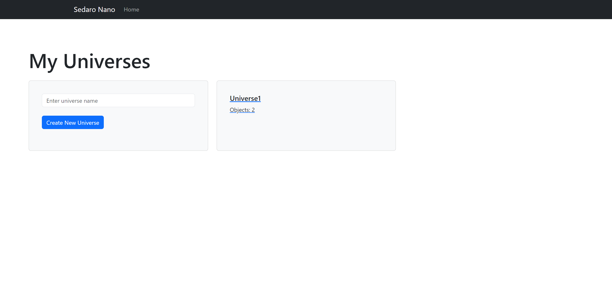
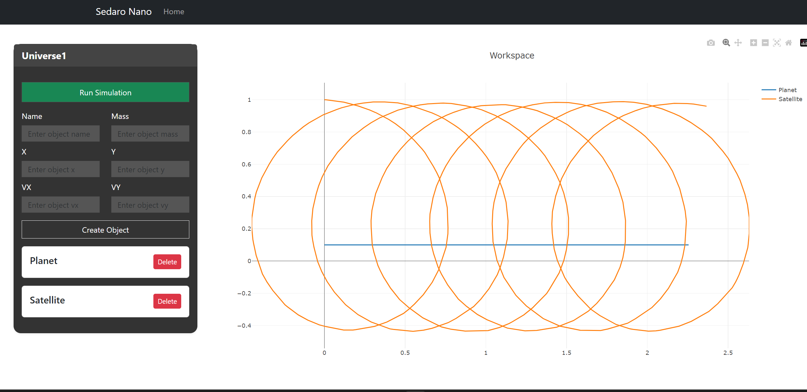

# Sedaro Nano

  

The tiniest possible mockup of our system

  
## Setup (NOTE: These are different from the original instructions)

  

1. Clone this repository.

2. To start the app, run the following command:

-  ```docker compose up --build```

- This will take a few minutes to run, especially the frontend!

4. Sedaro Nano should now be available via web browser at http://localhost:3000/. The backend api will be running at http://localhost:5000/ 

  

## Your Task

  

### Summary
I added a backend Flask API that replaces the sim.py file. The API allows you to add new objects, create new universe simulations, and run/plot simulations. The API can be accessed through the React frontend, which was modified to support multiple different simulations and a dashboard to access them.

### Structure
- Universe represents a workspace, or a simulation. Each Universe has Objects.
- Objects are things like Satellites, Planets, Rockets, that interact with each other in the simulation.
- Timestamps are points that the objects travel to within the simulation timeframe.

### Backend API Code
The backend consists of a Flask API (Python) and Sqlite3 Database. The backend stores the different timestamps of points in the database rather than on the client-side. While this increases runtime, I ultimately decided on this solution as it leaves room for further developments where you could save multiple simulation results for data analysis.
### `app.py`
Holds all the route for the API to interact with HTTP requests.

### `models.py`
Describes the schemas used for the database tables.

### `sim.py`
A slightly modified version of the original ```sim.py``` code that bootstraps the database with a default universe with a Satellite and Planet.
### `play.py`
An even further modified version of the original ```sim.py``` code that runs a certain universe's simulation. Some changes include modifying the gravity equation to support some concept of "mass", as well as more than 2 objects in space.

### Routes
## `GET /universe`
This route returns all the universe (simulation) objects in the database.
#### Example Request

```bash
curl --location 'http://127.0.0.1:5000/universe'
```

#### Example Response
```json
{
	"status":  "200",
	{
		"id":  1,
		"name":  "Universe1",
		"objects":  [...]
	},
	{
		"id":  2,
		"name":  "Universe2",
		"objects":  [...]
	{
}
```
## `GET /universe/<id>`
This route returns the universe object with that certain id.
#### Example Request

```bash
curl --location 'http://127.0.0.1:5000/universe/2'
```

#### Example Response
```json
{
	"status":  "200",
	{
		"id":  2,
		"name":  "Universe2",
		"objects":  [...]
	{
}
```
## `POST /universe`
This route creates a new universe (simulation) instance in the database.
#### Required Params
`name: String`
#### Example Request
```bash
curl --location 'http://127.0.0.1:5000/universe' \
--header 'Content-Type: application/json' \
--data  '
{
	"name": "Sample Universe"
}'
```
#### Example Response
```json
{
	"status":  "200",
	{
		"id":  4,
		"name":  "Sample Universe",
		"objects":  []
	}
}
```

## `POST /object`
This route creates a new object in a specific universe workspace.
#### Required Params
`name: String`
#### Example Request
```bash
curl --location 'http://127.0.0.1:5000/universe' \
--header 'Content-Type: application/json' \
--data  '
{
	"object_name":  "Daniel",
	"mass":  500,
	"universe_id":  2,
	"init":  {...}
}
```
#### Example Response
```json
{
	"status":  "200",
	{
		"id":  6,
		"mass":  500.0,
		"object_name":  "Spaceship",
		"timestamps":  [
			{
				"id":  2295,
				"time":  0.0,
				"timeStep":  0.01,
				"vx":  0.1,
				"vy":  0.0,
				"x":  2.0763233541494106,
				"y":  0.43222739681504196
			}
		]
	}
}
```

## `DELETE /object/<id>`
Deletes an object from its universe workspace.
#### Example Request
```bash
curl --location 'http://127.0.0.1:5000/object/2' 
```
#### Example Response
```json
{
	"status":  "200",
	{"success":  "Object deleted"}
}
```

## `POST /run`
Runs a specified universe's simulation, and returns the timestamps to plot.
#### Required Params
`universe_id: int`
#### Example Request
```bash
curl --location 'http://127.0.0.1:5000/universe' \
--header 'Content-Type: application/json' \
--data  '
{
	"universe_id":  1
}
```
#### Example Response
```json
{
	"status":  "200",
	{
		"id":  1,
		"name":  "Universe1",
		"objects":  [
			{
				"id":  1,
				"mass":  500.0,
				"object_name":  "Planet",
				"timestamps":  [...]
			}
		]
	}
}
```
### Frontend Client
At the home page, all the different universe workspaces appear on your dashboard. You can either create a new universe or enter an existing one.



In the simulation tab, you can access a specific universe workspace (A default one is given as part of the bootstrapping process). You can add different objects to the workspace with the add object form. for reference, the planet is of mass 500.0, and the satellite is of mass 5.0.  When you have added enough objects, you can run simulation to see the results (The simulation logic is fairly unchanged from the original, hence it is fairly instable). You must run AFTER you add in new objects.



### Future Solutions
- The interface and existing API is designed so that the system can host multiple users, enabling collaboration on simulations as well as private and public simulations to share.
- Since objects are stored in the database, team members could share different "Object" definitions with each other, allowing for increased productivity.
- A small "mass" based simulation model with multiple objects was implemented, but the numerical integration can be improved, as well as the physics model.
- More visualizations such as animation could be beneficial.


